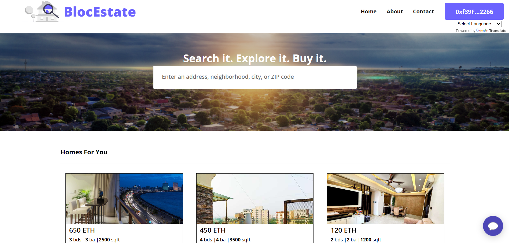

# BlocEstate - Empowering Property with Blockchain Security 🏠🔗  

BlocEstate is a decentralized real estate platform that leverages blockchain technology to ensure secure, transparent, and efficient property transactions. By eliminating intermediaries and integrating smart contracts, BlocEstate transforms the traditional real estate process into a streamlined, borderless experience.

---

## 📌 Table of Contents

- [Introduction](#introduction)
- [Objectives](#objectives)
- [Problem Definition](#problem-definition)
- [Key Features](#key-features)
- [User Interface Overview](#user-interface-overview)
- [Implementation Methodology](#implementation-methodology)
- [System Requirements](#system-requirements)
- [Technologies Used](#technologies-used)
- [Getting Started](#getting-started)
- [Contact](#contact)

---

## 🧠 Introduction

### 1.1 Gap in the Existing System

In today’s digital world, the real estate market still relies on outdated, non-transparent, and inefficient processes. BlocEstate addresses these issues by offering a blockchain-powered solution for property transactions. The platform ensures verifiable records, decentralized operations, and a user-friendly interface for seamless engagement between buyers and sellers.

---

## 🎯 Objectives

1. **Blockchain Integration** – Establish a secure, tamper-proof system for managing property transactions.  
2. **Smart Contracts** – Automate the buying/selling process, reducing the need for intermediaries and lowering costs.  
3. **User Experience** – Create a simple, intuitive interface to browse, list, and manage properties.  
4. **Global Reach** – Leverage blockchain’s borderless nature to include international users.

---

## 🚨 Problem Definition

Traditional real estate transactions face issues like:

- Lack of transparency in property history and deals.
- High transaction costs due to middlemen (brokers, banks, lawyers).
- Inefficiencies from delays and excessive paperwork.
- Increased fraud risk due to the number of intermediaries involved.

**BlocEstate** uses blockchain to solve these problems, offering a safer, faster, and more cost-effective solution.

---

## 🌟 Key Features

- **Decentralized Transactions**: Secure, transparent property deals via public ledger.
- **Smart Contract Automation**: Reduce reliance on intermediaries and speed up processes.
- **AI-Powered Chatbot**: 24/7 assistance to help users navigate the platform.
- **Multilingual Support**: Real-time translation for global accessibility.

---

## 🖥️ User Interface Overview

### 👇 Screens / Pages:

- **Home Page** – Entry point of the platform.
- **About BlocEstate** – Vision, mission, and overview of the platform.
- **Contact Us** – Contact IT staff for queries or feedback.
- **Properties Listing Gallery** – View all available property NFTs.
- **Property Details Page** – Detailed information about each property.
- **Transaction Steps:**
  - Buyer Initiates Transaction
  - Inspector Initiates & Approves Inspection
  - Lender Approves & Lends Property
  - Seller Finalizes Transaction & Transfers Ownership
- **Chatbot** – AI assistant for queries.
- **Language Translator** – Switch website content to user’s preferred language.

---

## 🧪 Implementation Methodology

### 2.1 Design

The core system uses smart contracts and NFTs to tokenize property ownership and manage transactions securely using an escrow contract.

### 2.1.1 Flowchart Summary

- Buyer selects property and initiates transaction
- Inspector inspects and approves the property
- Lender reviews and funds the deal
- Seller approves, transferring NFT to buyer

---

## 🧰 System Requirements

### Hardware Requirements

- Processor: Intel Core i3 or i5
- RAM: 4 GB minimum
- Storage: 2 GB available disk space

### Software Requirements

- Operating System: Windows (recommended)
- Web Browsers: Google Chrome, Mozilla Firefox, Microsoft Edge
- Tools & Frameworks:
  - React.js (Frontend)
  - Node.js (Backend)
  - Solidity (Smart Contract Language)
  - Hardhat (Ethereum Dev Environment)
  - Ethers.js (Blockchain Interaction)
  - MetaMask (Wallet Integration)

---

## 🛠️ Technology Stack & Tools Used

| Technology    | Purpose                          |
|---------------|----------------------------------|
| React.js      | Frontend Web Development         |
| Node.js       | Backend Logic & Server           |
| Solidity      | Smart Contracts                  |
| Hardhat       | Smart Contract Deployment        |
| Ethers.js     | Ethereum Blockchain Connection   |
| MetaMask      | Wallet for User Authentication   |
| IPFS          | Hosting Metadata for Properties  |

---

## Requirements For Initial Setup
- Install [NodeJS](https://nodejs.org/en/)
- Install [IPFS Desktop](https://docs.ipfs.tech/install/ipfs-desktop/)

## Setting Up
### 1. Clone/Download the Repository

### 2. Install Dependencies:
`$ npm install`

### 3. Run tests
`$ npx hardhat test`

### 4. Start Hardhat node
`$ npx hardhat node`

### 5. Run deployment script
In a separate terminal execute:
`$ npx hardhat run ./scripts/deploy.js --network localhost`

### 7. Start frontend
`$ npm run start`

---

## Contributors
Our project's success is a testament to the power of teamwork and collaboration. Each member of our team brought unique skills, knowledge, and enthusiasm to the table, contributing to the project's development in diverse ways.
Here are our group members:

1. [Mangesh Pangam](https://github.com/Mangesh2704)

2. [Rakshita Sarap](https://github.com/RakshitaSarap)

3. [Saish Rane](https://github.com/saishrane-11)
